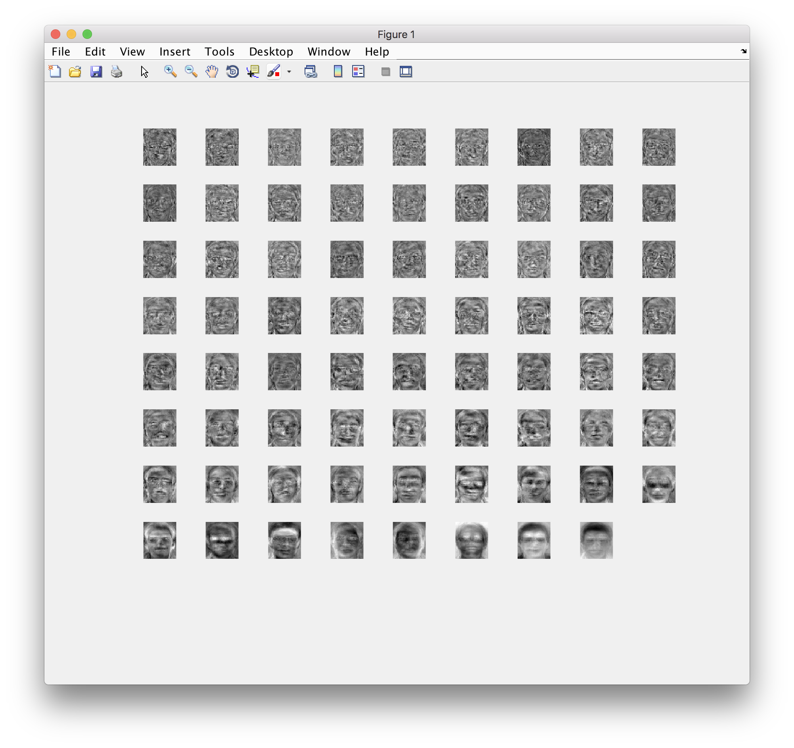

EigenFaces
===
Principal component analysis provides a set of eigen vectors for the covariance matrix of an array of images.

I am using 80 images, each having the same size, namely 81x72. 
We determine the covariance matrix and find the dominant eigen vectors. The visualisation of the dominant vectors give us the following results

All images are taken from the Yale dataset, namely yalefaces.

